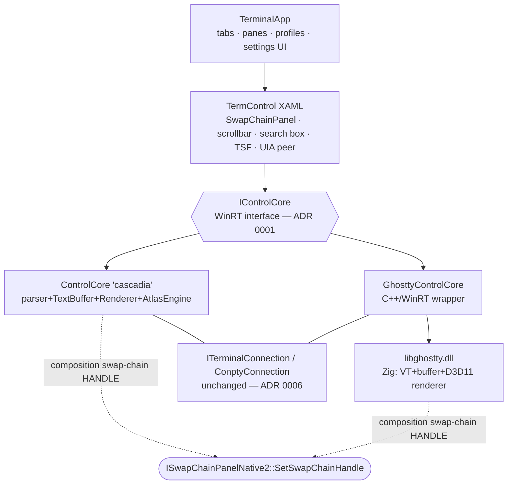

# winterm-ghostty — Design

Windows Terminal's shell (tabs, panes, profiles, settings) powered by ghostty's terminal
engine (VT parser, buffer, renderer) via `libghostty.dll`, selectable per profile beside
the stock cascadia engine.

Decisions and rejected alternatives live in `docs/adr/`. Background research (feasibility
study, synthesis design, source-project analyses) lives in `docs/research/`. Sequencing
lives in `PLAN.md`. This file is target-state architecture only.

## Repository layout

```
winterm-ghostty/
  DESIGN.md            this file
  PLAN.md              staged implementation plan (one phase ≈ one agent session)
  docs/adr/            architecture decision records
  docs/research/       feasibility study + synthesis design (background, superseded by this file)
  ghostty/             fork of ghostty-org/ghostty      (gitignored clone; branch `windows`, patch series per ADR 0004)
  terminal/            fork of microsoft/terminal       (gitignored clone; created in Phase 4)
  reference/           read-only clones: wintty, winghostty, phantty (gitignored)
  ghostty-patches/     exported `git format-patch` output — the tracked, reviewable form of the fork
  harness/             minimal Win32/WinUI hosts for testing libghostty.dll without WT (Phase 1–3)
  scripts/             build/CI helpers (Zig build wrappers, MSBuild invocations, patch-queue tooling)
  tools/               pinned Zig toolchain (gitignored; fetched by scripts/zigenv.ps1)
```

The forks are clones, not submodules. Only `ghostty-patches/` is tracked, so the fork is
always reproducible from *recorded upstream pin + exported patches* (ADR 0004).

## Architecture



Two parallel engine towers behind one interface. Each tower owns its parser, buffer, and
GPU renderer as a unit; they share no mutable state (no shared atlas/glyph cache — sharing
ideas and shaders, never objects). Both terminate in the same two primitives: `IControlCore`
upward, a DXGI composition swap-chain `HANDLE` into XAML, and both consume the same ConPTY
byte pipe. Profile setting `"engine"` picks the tower at pane creation (ADR 0007).

## The ghostty fork (`ghostty/`, patch series per ADR 0004)

### Renderer: `src/renderer/D3D11.zig` + `src/renderer/d3d11/` (ADR 0002)

Implements upstream's `Renderer(comptime GraphicsAPI)` contract (`src/renderer/generic.zig`,
~15 methods), mirroring `src/renderer/metal/` layout. Base: revived PR #11886 (D3D11) with
wintty's proven patterns and winghostty's robustness work.

```
d3d11/device.zig     device/context, WARP fallback, device-lost + TDR handling
d3d11/surface.zig    surface-mode union: hwnd | composition (dcomp handle) | shared_texture
d3d11/dcomp.zig      DCompositionCreateSurfaceHandle + CreateSwapChainForCompositionSurfaceHandle
d3d11/swapchain.zig  presentation policy (below)
d3d11/{Frame,RenderPass,Pipeline,buffer,Texture}.zig
d3d11/gpu_data.zig   byte-identical to Metal's structs (GenericRenderer writes the same bytes)
shaders/hlsl/        HLSL, premultiplied alpha, FLIP_SEQUENTIAL
```

Threading: keep ghostty's renderer thread (D3D11 is free-threaded). The
`must_draw_from_app_thread` escape hatch stays available but unused.

**Presentation policy** (the one component with no complete prior implementation; port
from AtlasEngine `AtlasEngine.r.cpp`, MIT):

1. Waitable composition swapchain (`GetFrameLatencyWaitableObject`, latency 1).
2. Damage gate — no state change ⇒ no Present (cursor-blink frames present nothing).
3. Partial uploads — winghostty's dirty-range mechanism generalized; viewport scroll is an
   index rotation + tail upload, never a full grid rebuild.
4. Vsync off ⇒ `ALLOW_TEARING`; occluded (host signals via `set_occlusion`) ⇒ draw timer
   stops.

### Platform / C API (`platform-win32` patch)

```c
// GHOSTTY_PLATFORM_WINDOWS = 3; fields are mode selectors, never retained pointers
typedef struct {
  void* hwnd;                                    // standalone/test harness mode
  bool  composition;                             // WT/WinUI: dcomp-surface-handle swapchain
  struct { bool enabled; uint32_t width, height; } shared_texture;
} ghostty_platform_windows_s;

void* ghostty_surface_get_swap_chain_handle(ghostty_surface_t);  // dcomp HANDLE for XAML
void* ghostty_surface_get_swap_chain(ghostty_surface_t);         // IDXGISwapChain1*
```

Plus: `ghostty_init` WTF-16 argv (`init-wtf16` patch); WM_KEYDOWN/WM_CHAR pairing buffer
in `apprt/embedded.zig`; read-back exports (`ghostty_surface_read_cells` /
`_read_selection` / `_read_text`) for search pips, UIA, and buffer export (`winkeys` patch).

### Termio: `termio-external` backend (ADR 0006)

Second variant beside `exec` in `src/termio/backend.zig`: embedder feeds PTY output via
`ghostty_surface_write_pty_output(ptr, len)` (backpressure-aware, same parse path as the
read thread); ghostty's encoded input flows out the existing write callback. WT keeps
ConPTY, defterm handoff, and the Azure connection untouched.

### Fonts (ADR 0005, `dwrite-discovery` patch)

`directwrite_freetype` backend: DirectWrite discovery with
`IDWriteFontFallback::MapCharacters` + negative cache; FreeType grayscale rasterization;
HarfBuzz shaping. Named gap: COLRv1 emoji (FreeType has the API; the glyph pipeline must
call it). DWrite rasterization deliberately deferred — AtlasEngine's
`DWriteTextAnalysis.cpp`/`dwrite_helpers.*` are the reference if revisited.

### IO hardening (`iocp-fixes` patch)

- libxev IOCP timer-completion fix (from winghostty; also offered to mitchellh/libxev
  directly): completed timers stay `.active` until their callback pops — resetting from
  another callback corrupts the intrusive queue.
- 64 KiB double-buffered overlapped PTY reads replacing the 1 KiB blocking loop.
- `getProcessInfo` via root-process + child enumeration (mostly moot under ADR 0006 since
  WT's connection owns the process, but correct for standalone embedders).
- PowerShell shell-integration script (OSC 133 marks, OSC 7 pwd, OSC 9;4 progress).

## The Windows Terminal fork (`terminal/`)

### The seam (ADR 0001)

`ControlCore.idl` + `ICoreState.idl` → `IControlCore`. `TermControl.h` and
`ControlInteractivity.h` hold the interface. The six `get_self<ControlCore>` escapes gain
IDL: `SearchResultRows`, QuickFix viewport query, `PersistTo`/`RestoreFromPath`/
`UpdateQuickFixes`/`PreviewInput`. Cascadia engine is implementation #1, unchanged in
behavior; this change is upstreamable on its own.

### `GhosttyControlCore` — obligation map

| IControlCore area | Implementation over libghostty |
|---|---|
| Initialize / SizeOrScaleChanged | `ghostty_surface_new` (composition mode) → `_set_size`/`_set_content_scale`; cell metrics drive `Connection.Resize` |
| SwapChainHandle / SwapChainChanged | `ghostty_surface_get_swap_chain_handle()` → existing `_AttachDxgiSwapChainToXaml` path, unchanged |
| Key/char/mouse input | `ghostty_surface_key`/`_text`/`_mouse_*` (pairing handled in-DLL) |
| Scroll state + UserScrollViewport | `SCROLLBAR` action ↔ viewport scroll calls |
| Title/TabColor/Taskbar/CWD events | `SET_TITLE`, `COLOR_CHANGE`, `PROGRESS_REPORT`, `PWD` actions |
| Clipboard | read/write clipboard callbacks ↔ `WriteToClipboard`/paste request events |
| Selection / SelectedText / SelectionInfo | `SELECTION_CHANGED` action + `_read_selection` read-back |
| Search / SearchResults / pips | `START_SEARCH`/`SEARCH_TOTAL`/`SEARCH_SELECTED` actions (wintty precedent) |
| Marks / ScrollToMark / SelectCommand | ghostty prompt marks (needs PowerShell integration script) |
| Hyperlinks (hover trio, OpenHyperlink) | `MOUSE_OVER_LINK` / `OPEN_URL` actions |
| IME | WT TSF handler → `ghostty_surface_preedit` + `_ime_point`; ghostty renders preedit inline (dissolves `tsfPreview` coupling) |
| ReadEntireBuffer / CommandHistory | `_read_text` read-back / stub initially |
| ConnectionState, WarningBell, ShowWindow | direct mappings |
| Settings ctor | `IControlSettings`/`IControlAppearance` → `ghostty_config_t` translator |
| Stub initially | completions, quick fixes, PersistTo/Restore, ColorSelection, MIDI, retro shader (ghostty custom shaders later) |
| NEW_TAB / NEW_SPLIT actions | return false — WT's own keybindings own tab/split creation |

### Degradation ladder

1. Hardware D3D11 device → 2. **WARP** (same code path; covers RDP/driverless) →
3. device-removed → rebuild device+swapchain, re-raise `SwapChainChanged` (handle-based
binding makes re-attach clean) → 4. engine init failure → `RendererEnteredErrorState` +
profile fallback to `"engine": "cascadia"`.

Steps 1–2 are **verified on the dev box** (`harness/warp-probe`, 2026-07-31): hardware,
`D3D_DRIVER_TYPE_WARP`, and the explicit `EnumWarpAdapter` adapter all create a device at
**feature level 11_1** with `D3D11_CREATE_DEVICE_BGRA_SUPPORT`. WARP presenting as an
equal feature level to hardware is what lets step 2 be "the same code path" rather than a
reduced one. `dcomp.dll` and `DCompositionCreateSurfaceHandle` are present, so the Phase 2
composition path has its prerequisites.

Caveat for Phase 7: `D3D11_FEATURE_DATA_THREADING` reports
`DriverConcurrentCreates=1` but **`DriverCommandLists=0` on both hardware and WARP** —
deferred-context command lists are runtime-emulated on this hardware, not driver-native.
That does not affect the design (ADR 0002 keeps a single renderer thread on the immediate
context), but it rules out "record command lists on worker threads" as a free Phase 7
optimisation; it would have to be measured, not assumed.

### Accessibility

Reimplement `ITextProvider`/`ITextRangeProvider` over the read-back API behind WT's
`InteractivityAutomationPeer`. Harvest range/navigation semantics from winghostty's
working `win32_uia/` implementation (MIT). Ship gate for parity; flagged-off before that.

### Packaging constraints

Engine DLL: self-contained CRT, MSVC ABI, x64 + ARM64. D3D11/DXGI/DComp/ConPTY/font-file
access are appcontainer-compatible API sets; MSIX API-set validation is a Phase-1 exit
criterion, with "engine DLL hosted outside the packaged component" as the recorded fallback.

## Source material (harvest map)

| Source | Take | License |
|---|---|---|
| deblasis PR #11886 (ghostty-org/ghostty) | D3D11 module base, composition approach, upstream PR shape | MIT |
| wintty (deblasis/wintty) | surface-mode union, dcomp handle export, platform tag, atomic resize, device-loss, gpu_data parity rule, DWrite discovery, pending-key buffer, read-back exports, WinUI SwapChainPanel binding recipe | MIT |
| winghostty (amanthanvi/winghostty) | libxev IOCP fix, frame-health plumbing, partial uploads, startup diagnostics, UIA implementation | MIT |
| phantty (arya-s/phantty) | fallback negative-cache design, DirectWrite COM binding reference | README-MIT, **no LICENSE file — read, don't copy** |
| AtlasEngine (microsoft/terminal) | waitable swapchain, damage-gated present, ALLOW_TEARING, WARP/adapter selection, grayscale-over-transparency rule; DWrite raster reference for later | MIT |
| mite (marler8997/mite) | clean-code D3D11+DWrite reference | **no license — read, don't copy** |
| zcg/ghostty-win | independent D3D11/D2D confirmation | MIT |

## Upstream pins

Recorded in Phase 0 (2026-07-31). Never advance a pin outside a readiness/retro step.

| Repo | Pin | Date | Role |
|---|---|---|---|
| `ghostty-org/ghostty` | `4d605bf0d819df901a0332bbb320dc849fdd82e4` | 2026-07-30 | fork base for `ghostty/` (Phase 1) |
| `microsoft/terminal` | `ca7996296a48322c1c7310af59d4ee2949421679` | 2026-07-31 | fork base for `terminal/` (Phase 4) |
| PR #11886 head | `bb8909dcba933025556378d2f323edc90b5bc929` | 2026-03-27 | D3D11 base; diff + shader blobs archived in `docs/research/` |
| `deblasis/wintty` | `f4b3ac8ff09a6ef7f1c3397ce2aa9622140b24e8` | 2026-07-30 | reference (read-only) |
| `amanthanvi/winghostty` | `cff48552a942faeca24c8eda12b375bd3445fbec` | 2026-07-31 | reference (read-only) |
| `arya-s/phantty` | `d8b63ae6e1bca54a198c9435bf449d3a36ee2ca1` | 2026-02-12 | reference (read-only, **no LICENSE — read, don't copy**) |

The research that produced this document was conducted against the same ghostty pin.

## Toolchain (Phase 0 machine)

| Tool | Version | Notes |
|---|---|---|
| Zig | **0.16.0** | pinned by ghostty `build.zig.zon` (`.minimum_zig_version`) and `flake.nix`; local copy under `tools/`, installed by `scripts/zigenv.ps1` |
| Visual Studio | Community **2026** 18.8.12023.21 | MSVC **v145** (14.51.36231). WT's `src/common.build.pre.props` selects v145 when `VisualStudioVersion >= 18.0`, and WT's README ships a winget config for VS 2026 — VS 2022/v143 is *not* required. |
| Windows SDK | 10.0.**26100.8249** | meets WT's `>= 10.0.26100.8249` floor |
| Shader compilers | `fxc` + `dxc` from the SDK | D3D11 needs **`fxc` / SM 5.0 DXBC**; `dxc`/SM 6 DXIL is D3D12-only (see `docs/research/pr-11886-assets/README.md`) |
| .NET SDK | 10.0.302 | for wintty's WinUI 3 harness reference only |

GPU: AMD Radeon 890M (integrated, Ryzen AI 9 HX 370). WARP-path validation is done over
an RDP session into the same machine.
